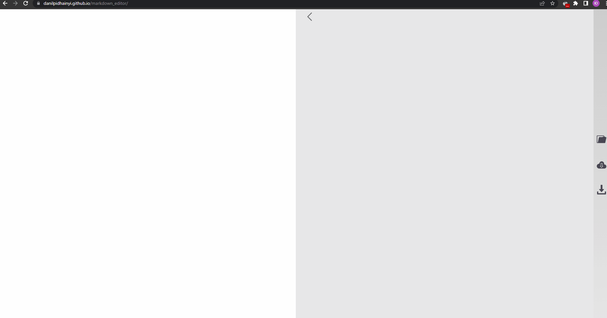

# markdown-editor

Редактор markdown розмітки.

## Демо - [посилання](https://danilpidhainyi.github.io/markdown_editor/).

## Стек

- React
- Webpack
- CSS Grid + Flexbox
- markedjs

## Функціонал

- Відкриття файлу локально   

  
  
- Зберігання тексту в local storage браузера

  
  
- Завантаження файлу

  
  

  

